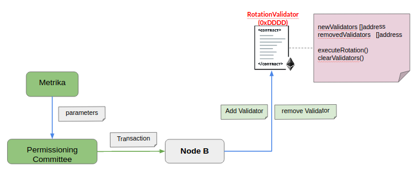

# Solution Architecture

In this section we will review the different components of the architecture, function and relationship with the other components.

This solution serves to rotate validators that do not behave properly. This means that based on metrics obtained from the behavior of active validators these will be rotated, new nodes will be promoted as validators and the nodes that were working as validators but had crashes, failures or bad behavior will not be considered as validators and will be removed from the list of validators of the blockchain.

## Backend Components

### Node
Is a validator node part of the LACChain network. It use Hyperledger Besu with which the p2p connection is maintained, broadcast transactions with the other nodes of the network. This component generate new blocks in the network.

### Rotation Client
Its role is to listen to Rotation smart contract events. Specifically the event that starts validators rotation (event RotationStarted). When this event is emitted, the nodes that are validators first obtain concurrently the list of the new nodes that will be validators and the list of the nodes that will be removed as validators. After obtaining the lists, the node begins to vote to remove and add the new validators.

## Smart Contracts

### Rotation
This smart contract is in charge of recording the new nodes that will be validators and the validator nodes that will be removed in the next round, which won't generate blocks. It is also in charge of emiting the event that starts the rotation of validators in the LACChain network. In addition, this contract is in charge of recording the state of the validators in the network (active, inactive, new).

## Behavior

### Record a node which will/won't be validator

Based on the metrics sent by monitoring, it is chosen which node will be added and which will not be part of the consensus in the next round of blocks. Validator address is registered in the Rotation smart contract.

### Start Validators Rotation

Based on the alerts sent to the permissioning committee indicating the bad behavior of a validator node and the need to start the rotation of validators, the permissioning committee will start validators rotation, sending a transaction to the Rotation smart contract so that the "RotationStarted" event would be emitted.

### Vote for add/remove validator

Validator nodes assisted by the client component are listening for events from Rotation smart contract. When the executeRotation event is emitted then the client concurrently uses this [ibft-api](https://besu.hyperledger.org/en/stable/Reference/API-Methods/#ibft_proposevalidatorvote) and begins to send the requests to the blockchain validator node, which will remove and add validators to the next round of block generation.